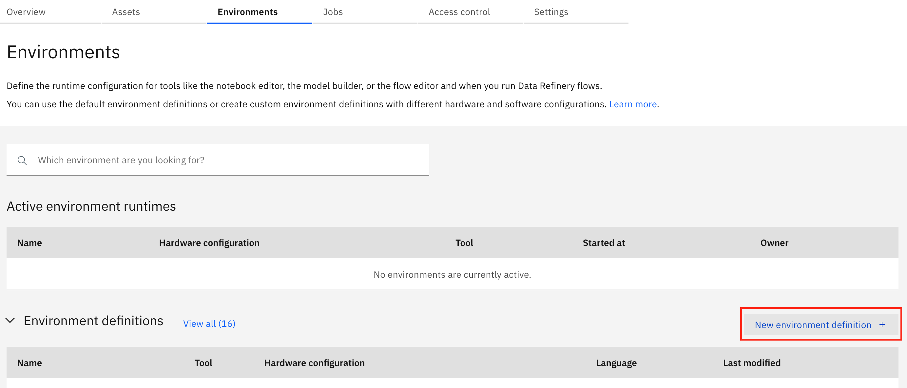
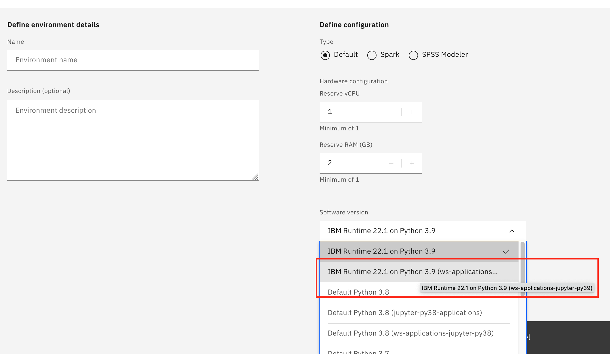
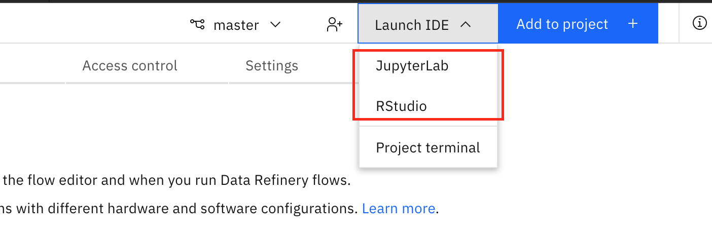
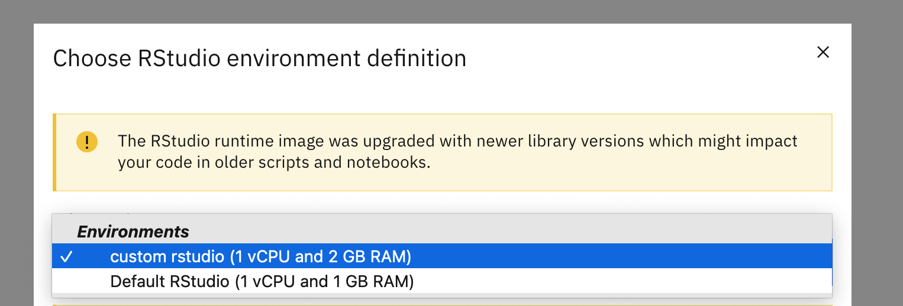
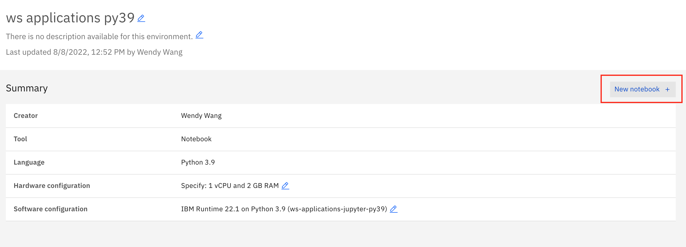

# Getting Started: Create Custom Images for Watson Studio (Cloud Pak for Data)

## Preparation

### Access to docker and container registries
Make sure that you 
- have [docker](https://www.docker.com/get-started/) installed in your environment
  - check and confirm that in your terminal, you are able to run docker commands by typing:
  ```
  docker --help
  ```
- have the username and password to `cp.icr.io`, the container registry for base images (see [this page](./cluster_secrets.md) if you do not know it)
- have the username and password to your container registry for custom images
- configured the Cloud Pak for Data cluster to access your container registry for custom images (see [this page](cluster_secrets.md) if you have not done it yet)

### Access to Cloud Pak for Data and/or OpenShift as admin
Everything is easier if you are **an admin of the Cloud Pak for Data cluster** you want to add a custom image to, with **access to the OpenShift backend**. If not, you may need to work with your Cloud Pak for Data admin and/or OpenShift admin to complete the whole process.

The access needed for each step will be specified separately.

## Step 1: Get Base Image Names for Target Watson Studio Runtimes
All custom images to be used in Watson Studio need to be based on the default runtime images.

Access role required:
- **Cloud Pak for Data admin role**

Run the following commands to set up your credentials to your Cloud Pak for Data cluster:
```bash
export BASE_URL=<your cpd link>
export USERNAME=<your username>
export APIKEY=<your apikey>
```

For example:
```bash
export BASE_URL=https://mycpd.com
export USERNAME=wendy
export APIKEY=ziE9KHmhKy2aHemKLeXa2CjTXpJbse8ZKjzoxH7d
```
(The above is a dummy example.)

Now you can run the following commands to list the base image names you are looking for:
```bash
python cli_ws_image.py default list --cpu # python jupyter environments, non-gpu
python cli_ws_image.py default list --gpu # python jupyter environments, gpu
python cli_ws_image.py default list -a # python jupyter environments, non-gpu + gpu
python cli_ws_image.py default list --rstudio # rstudio environments
```

If your Cloud Pak for Data is not the latest version, you need to specify which version it is on, because each Cloud Pak for Data version corresponds to a different set of base images that might have dependency on this specific version and cannot work properly on an older or newer version. This can be done by argument `--cpd-version <version>`. For example:
```bash
python cli_ws_image.py default list --cpu --cpd-version 4.0.6
```

If the output looks good, you can export the base image names into a text file by adding an argument `--export-fn <filename>`. For example:
```bash
python cli_ws_image.py default list --cpu --cpd-version 4.0.6 --export-fn base_images_nongpu_406.txt
```

You may use the overwrite flag `--overwrite` (or `-o`) to overwrite the file if it exists.

This exported text file is needed in the build step. You can of course create this text file of base image names manually.

## Step 2. Build and push the custom image(s)
No matter how many base images you need to build a custom image for, you only have to run the build command once for each dockerfile. 

What does it mean?

You may have created a dockerfile that you want to apply for both python 3.8 and python 3.9 base image. In this case, you can manually edit the base image list to keep only the image names you want to build a custom image for. The build command will loop through all the base image names in the list, build one custom image for each base image using the same dockerfile provided, and push all of them to the target container registery.

Access required:
- **username and password to the container registry for base images (`cp.icr.io`)**
- **username and password to your container registry for custom images**

### 1. Login to both container registry
Before running the build command, you need to authenticate to both the CPD base image container registry as well as your custom image container registry.
#### 1.1 CPD base image container registry
To login to `cp.icr.io`, run the following:
```bash
docker login cp.icr.io --username <username> --password <password>
```
If you do not have it, you will need **openshift access** to extract the credentials (see [this page](./cluster_secrets.md)) or ask your openshift admin to do it.

#### 1.2 custom image container registry
To login to the container registry for custom images, you can run a similar `docker login` command. If you are usng IBM Cloud Container Registry for this purpose, you can also use the following command:
```bash
ibmcloud login -g <resource-group> --apikey <iam-apikey> && ibmcloud cr login
```

### 2. Run CLI command
The `custom build` command builds the custom images and pushes each of them to the target container registry for custom images.
```bash
python cli_ws_image.py custom build --registry-url <registry-for-custom-image> --registry-namespace <namespace> --dir-dockerfile <directory-of-dockerfile> --base-image-list <path-to-base-image-list> --custom-image-name-pattern <pattern>
```

For example:
```bash
python cli_ws_image.py custom build --registry-url us.icr.io --registry-namespace cpd-custom-image --dir-dockerfile ../custom-image --base-image-list base_images_nongpu_408.txt --custom-image-name-pattern {image_name}-ws-applications
```

Note that:
- **base-image-list**: this is the path to the file after switching to **dir-dockerfile**, not relative to where you run the command
- **custom-image-name-pattern**: this is a name pattern, where `image_name` can be optionally used to refer to the original/base image name

## Step 3. Register in CPD Service
In order to use the custom image, the target service in Cloud Pak for Data needs to be aware of this image.

For Watson Studio, this involves:
- a new or updated runtime config

For Watson Machine Learning, this involves:
- a new or updated software specification
- a new or updated runtime config

Access role required:
- **Cloud Pak for Data admin role**


The following command registers ONE custom image in Watson Studio:
```bash
python cli_ws_image.py custom register
```
If you have multiple custom images, you may need to run the command for multiple times, unless you created one custom image to be registered for **each available Python Jupyter runtime** (there is only 1 Rstudio runtime as of 4.0.x so you won't encounter this for Rstudio).

Note that:
- You may use the flag `--dry-run` to test the command and assess the generated json file, without really adding it to Watson Studio's runtime definitions.
- Use argument `--cpd-version` or `-v` if the Cloud Pak for Data cluster is not on the latest version. This information is used to get all the candidate runtime definitions for this version.
- Use argument `--python-version` or `-py` if there are multiple candidate runtime definitions for this Cloud Pak for Data version (usually each corresponds to a different python version), and you want to register a custom image for only a specific python version.
- `--config-filename-pattern` or `-c`: used to provide a filename pattern for each final config file (one for each final candidate runtime definitions). By default it is `custom-{filename}`, where `{filename}` refers to the original config filename. Note that **`{filename}` has to be at the end of the pattern** (do not add anything after it).
- `--display-name-pattern` or `d`: used to provide a display name pattern in each final config file. By default it is `{display_name} (custom)`. 
- `--image-name-pattern` or `-i`: used to provide an image name pattern for each custom image. By default it is `us.icr.io/custom-image/{image_name}-custom:2`, where `{image_name}` refers to the original image name of the base image, similar to the previous commands.

### 3.1 Python Jupyter
Special arguments to use:
- You need to specify one of `--jupyter` (to generate config for jupyter notebook runtimes only), `--jupyterlab` (to generate config for jupyterlab runtimes only), or `--jupyter-all` (to generate config for both jupyter notebook and jupyterlab runtimes).


The command looks like the following:
```bash
python cli_ws_image.py custom register --jupyter-all -c <config-filename-pattern> -d <display-name-pattern> -i <image-name-pattern>
```

For example:
```bash
python cli_ws_image.py custom register --jupyter-all -c ws-applications-408-{filename} -d "{display_name} (ws applications)" -i us.icr.io/custom-image-ws-applications/{image_name}-ws-applications:4.0.8 -v 4.0.8
```

### 3.2 Rstudio
Special arguments to use:
- You need to specify `--rstudio`.


The command looks like the following:
```bash
python cli_ws_image.py custom register --rstudio -c <config-filename-pattern> -d <display-name-pattern> -i <image-name-pattern>
```

For example:
```bash
python cli_ws_image.py custom register --rstudio -c custom-408-{filename} -d "{display_name} (custom)" -i us.icr.io/cpd-custom-image/{image_name}-custom:23 -v 4.0.8
```

## Step 4. Test New Environment
Now you can go to the Cloud Pak for Data cluster, enter a Watson Studio project where your new environment is allowed to be used (e.g., JupyterLab environment is only available in a Git-connected project).

Access role required:
- **None**

Click on the **New environment definition** button:


Then from the dropdown list, you should be able to find and choose the custom runtime you just registered for the custom image:


Once you created a new environment definition using the custom runtime, you can test it in the following way.
- For JupyterLab or Rstudio environments, click **Launch IDE** -> **JupyterLab** or **Rstudio**, then choose the new environment definition from the dropdown list.


- For Jupyter Notebook environments, open an exsiting notebook with this new environment definition, or click on this **New notebook** button to open a new notebook using this definition.


**It can take a while for the environment to start**, because the image needs to be pulled to the worker node. If you have openshift access, you will be able to see the pod events to track the progress.